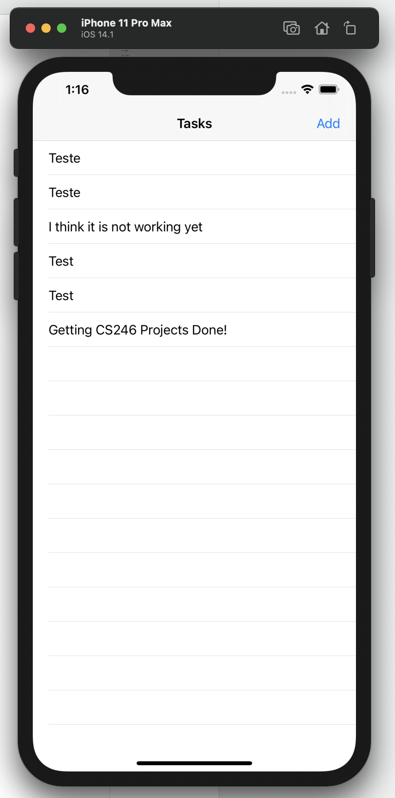

# OVERVIEW

This is an idea of a Todo List project using Swift. It is really basic, but it requires so many of the basic learning to build it. 
Here are some of them that I used:

Variables - (mutable and unmutable - "let" and "var")
Expressions - (as? | is | self)
Conditionals - (if | else | guard)
Loops - (for loop)
Functions - (func updateTasks())
Classes - (class ViewController: UIViewController)

## Development Environment

* XCode 12
* Swift
* Macbook Pro

## Execution

It is required to have a machine running MacOS and install XCode. While running the project in XCode, select the type of iPhone you would like
to emulate and use the app. The app works by clicking on the "Add" button and type down the task you would like to add to the Todo List. After typing
you can "save" it and see it on the main screen.

